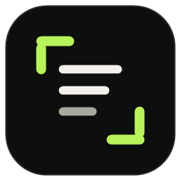

<p align="center">
  
</p>

<h1 align="center">拾字 Shizi — Windows 与 macOS 屏幕 OCR 取字工具</h1>

<p align="center">框选屏幕文字，本地识别，自动复制，随处粘贴。</p>

<p align="center"><a href="README.md">English</a> · <strong>简体中文</strong></p>

拾字是一款支持 Windows 与 macOS、开源且隐私优先的**屏幕 OCR**、**截图文字提取**与 **OCR 自动复制**工具。按下全局快捷键，框选网页、图片、扫描 PDF、视频或桌面软件中的文字，识别结果会自动进入剪贴板。

## 下载

前往 [GitHub Releases](https://github.com/SynapShift/shizi/releases/latest) 下载最新版。

| 安装包 | 适用场景 |
| --- | --- |
| `Shizi-Setup-*-win-x64.exe` | 推荐。安装一次，之后可从开始菜单启动拾字。 |
| `Shizi-*-win-x64.zip` | 便携版。解压后双击 `Shizi.exe` 即可使用。 |
| `Shizi-*-macOS-universal.dmg` | macOS 安装镜像，同时支持 Apple 芯片和 Intel Mac。 |
| `Shizi-*-macOS-universal.zip` | macOS 便携版，同时支持 Apple 芯片和 Intel Mac。 |

Windows 安装包已包含 .NET 运行时和本地 PP-OCRv5 模型；macOS 版本使用系统自带的 Vision 框架。两个平台都无需另外安装运行环境或下载模型。

**系统要求：** Windows 10 1903 或更高版本（x64），或 macOS 13 Ventura 及以上版本。Mac 首次取字时需要授予“屏幕录制”权限。

当前 macOS 安装包使用临时代码签名，尚未经过 Apple 公证。首次打开时请按住 Control 点击拾字，选择“打开”，并在 Gatekeeper 中确认一次。

## 功能

- Windows 使用 `Alt + Shift + A`，macOS 使用 `Option + Shift + A`
- 多显示器区域框选
- Windows 使用 PP-OCRv5，macOS 使用 Apple Vision，均在本地识别
- Windows OCR 自动兜底
- 自动清理视觉断行和中文伪空格
- 识别完成后自动复制到剪贴板
- 可选保留原始换行
- 托盘常驻与轻量结果提示
- 可设置是否随 Windows 登录自动运行
- 截图不会上传

## 使用方法

1. 启动拾字。
2. 按 `Alt + Shift + A`，或点击主界面的“开始取字”。
3. 拖动鼠标框住需要提取的文字。
4. 松开鼠标，等待复制成功提示。
5. 在任意输入框按 `Ctrl + V`。

按 `Esc` 可以取消框选且不会覆盖原剪贴板。关闭主窗口后，拾字会继续在系统托盘运行。

## 为什么选择拾字？

- **少一步：** 框选后直接粘贴，不需要管理识别结果窗口。
- **本地优先：** OCR 在设备本地完成，截图不会上传。
- **中文友好：** PP-OCRv5 配合文本清洗规则，适合中文和中英混排内容。
- **不限浏览器：** 桌面软件、图片、视频和扫描文档都能取字。

## 从源码构建

Windows 开发需要 .NET 8 SDK；macOS 开发需要 Swift 5.9 或更高版本。

```powershell
dotnet run --project .\src\Shizi\Shizi.csproj
dotnet build .\src\Shizi\Shizi.csproj -c Release
dotnet run --project .\tests\Shizi.SmokeTests\Shizi.SmokeTests.csproj -c Release
```

```bash
swift test --package-path ./src/ShiziMac
swift run --package-path ./src/ShiziMac
```

## 路线图

- [ ] 自定义全局快捷键
- [x] PP-OCRv5 本地识别引擎
- [x] Windows 安装包与便携压缩包
- [x] 使用 Apple Vision OCR 的原生 macOS 版本
- [x] macOS 通用 DMG 与 ZIP 安装包
- [ ] 翻译后复制
- [ ] 图片表格转可编辑数据
- [ ] 可选的本地识别历史
- [ ] Chromium 扩展：DOM 精确提取、OCR 兜底

## 隐私

Windows 版优先使用随软件提供的本地 PP-OCRv5 模型，失败时自动切换到 Windows OCR；macOS 版使用设备内置的 Apple Vision 框架。截图不会发送到服务器。Windows OCR 兜底过程中可能在系统临时目录创建短生命周期的 PNG 文件，识别结束后会立即删除。


## 反馈与贡献

欢迎提交 Issue 或 Pull Request。反馈问题请使用 [Issue 表单](https://github.com/SynapShift/shizi/issues/new/choose)；如需附图，请先移除账号、聊天内容等敏感信息。

## 许可证

[MIT](LICENSE)
